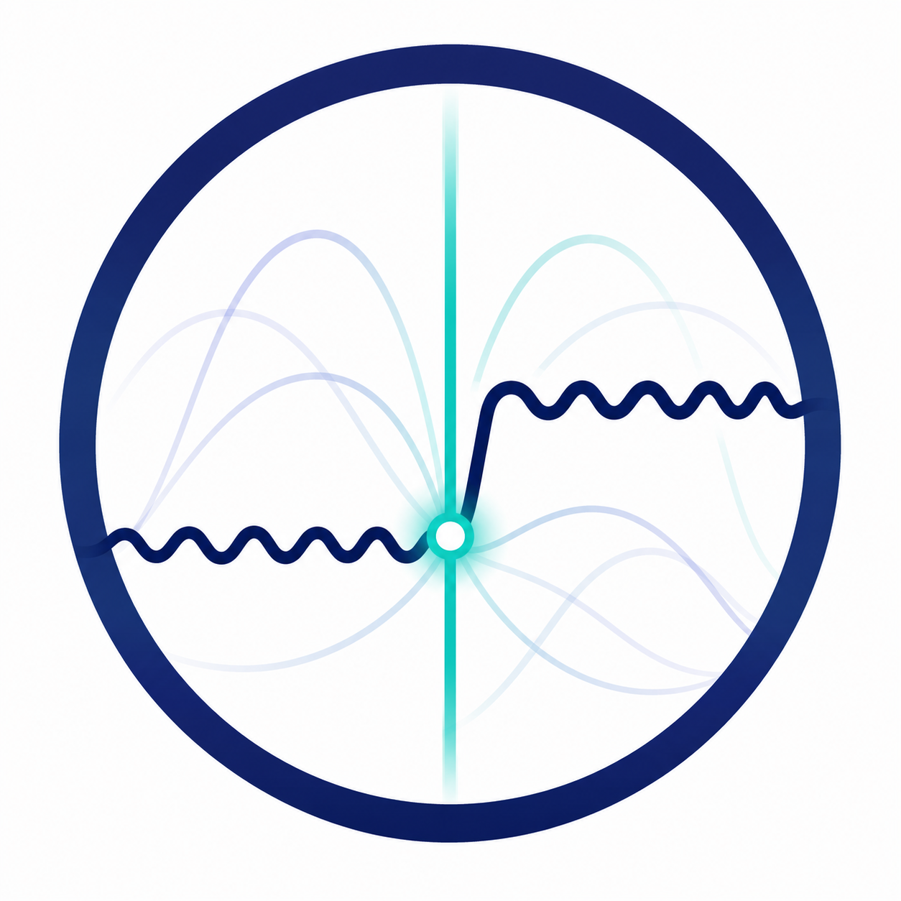
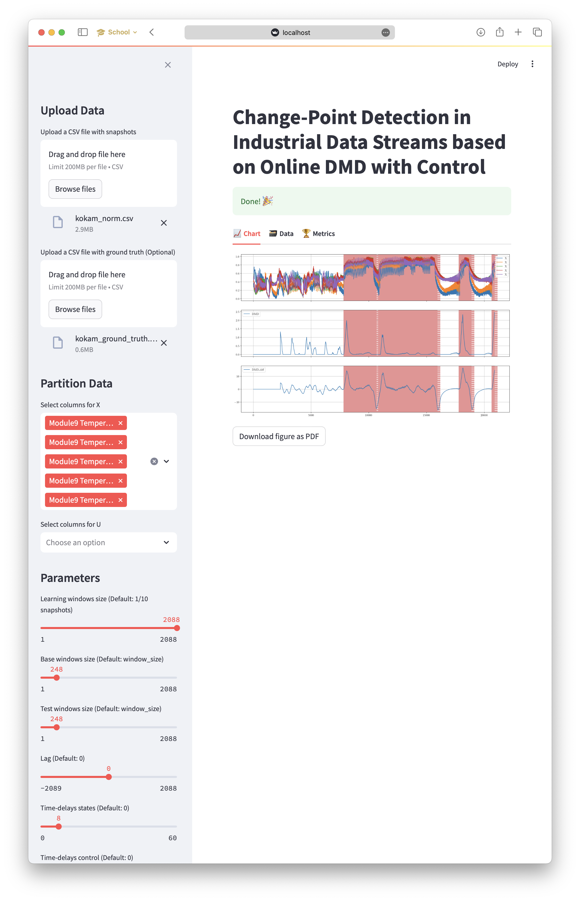

<p align="center">
  
</p>

<h1 align="center">reshift</h1>

<p align="center">
  <strong>Catch the moment a machine or process changes its behaviour — live, before it becomes a failure.</strong>
</p>

<p align="center">
  <em>Online, model-free change-point detection for noisy, multivariate industrial sensor streams.<br/>Control-aware, noise-robust, and tuned to keep false alarms low — no physical model, no batch retraining.</em>
</p>

<p align="center">
  <a href="https://github.com/MarekWadinger/reshift/actions/workflows/ci.yml"></a>
  <a href="https://codecov.io/gh/MarekWadinger/reshift"></a>
  <a href="LICENSE"></a>
  
  <a href="https://arxiv.org/abs/2407.05976"></a>
</p>

---

## Highlights

- **Adaptive linearization** -- ODMDwC tracks non-linear system behaviour online, keeping detected change magnitude proportional to the real shift.
- **Control-aware** -- exploits control inputs to tell operator-driven dynamics apart from genuine anomalies.
- **Noise-robust** -- truncated ODMDwC with higher-order time-delay embeddings captures broadband features and suppresses noise.
- **Benchmark-leading** -- outperforms SVD- and autoencoder-based CPD on the SKAB and CATS datasets (NAB score).
- **Streaming-native** -- built on [`river`](https://riverml.xyz): single-pass, constant-memory updates, no batch retraining or physical model.
- **Tunable by intuition** -- practical hyperparameter guidance instead of black-box knobs.



## Overview

As the energy sector races toward radical climate action, scaling new solutions is essential. Automated control has been crucial to efficient operations, and detecting unforeseen critical shifts can be a game-changer for safety.

This repository implements change-point detection (CPD) based on **Online Dynamic Mode Decomposition with Control (ODMDwC)**. Designed for complex industrial systems where timely detection of behavioural shifts is critical, it captures both spatial and temporal system patterns and adapts dynamically to non-linear changes from factors like aging and seasonality. It addresses non-uniform data streams in safety-critical systems without depending on exhaustive physical models, leveraging control input to yield robust, intuitive results even under high noise.

## Benchmark Evaluation

We validated our approach on both synthetic and real-world datasets, including:

1. [SKAB](https://github.com/waico/SKAB) Laboratory Water Circulation System

    | **Algorithm**                  | **NAB (standard)** | **NAB (low FP)** | **NAB (low FN)** |
    |--------------------------------|--------------------|------------------|------------------|
    | Perfect detector               | 54.77              | 54.11            | 56.99            |
    | **CPD-DMD (\(t=0\))**          | **34.29**          | 23.21            | **42.54**        |
    | **CPD-DMD (\(t=0.0025\))**     | 33.43              | **23.28**        | 41.71            |
    | MSCRED                         | 32.42              | 16.53            | 40.28            |
    | Isolation forest               | 26.16              | 19.50            | 30.82            |
    | T-squared+Q (PCA)              | 25.35              | 14.51            | 31.33            |
    | Conv-AE                        | 23.61              | 21.54            | 27.55            |
    | LSTM-AE                        | 23.51              | 20.11            | 25.91            |
    | T-squared                      | 19.54              | 10.20            | 24.31            |
    | MSET                           | 13.84              | 10.22            | 17.37            |
    | Vanilla AE                     | 11.41              | 6.53             | 13.91            |
    | Vanilla LSTM                   | 11.31              | -3.80            | 17.25            |
    | Null detector                  | 0.00               | 0.00             | 0.00             |

2. [CATS](https://www.kaggle.com/datasets/patrickfleith/controlled-anomalies-time-series-dataset) Controlled Anomalies Dataset

    | **Algorithm**                  | **NAB (standard)** | **NAB (low FP)** | **NAB (low FN)** |
    |--------------------------------|--------------------|------------------|------------------|
    | Perfect detector               | 30.21              | 29.89            | 31.28            |
    | **MSCRED**                     | **37.19**          | 13.46            | **47.18**        |
    | **CPD-DMD (\(t=0\))**          | 25.66              | **20.62**        | 29.84            |
    | **CPD-DMD**                    | 17.84              | 15.01            | 20.06            |
    | Isolation forest (\(c=3.8\%\)) | 17.81              | 15.84            | 20.00            |
    | T-squared+Q (PCA)              | 11.80              | 11.40            | 12.30            |
    | LSTM-AE                        | 11.39              | 11.26            | 11.69            |
    | T-squared                      | 15.15              | 14.98            | 15.71            |
    | MSET                           | 14.48              | 13.43            | 15.60            |
    | Vanilla AE                     | 2.52               | 2.44             | 2.77             |
    | Vanilla LSTM                   | 0.73               | 0.70             | 0.82             |
    | Conv-AE                        | 0.15               | 0.14             | 0.18             |
    | Null detector                  | 0.00               | 0.00             | 0.00             |

## 📜 Citation

If you use this platform for academic purposes, please cite our publication:

```bibtex
@misc{wadinger2024changepointdetectionindustrialdata,
    author    ={Marek Wadinger and Michal Kvasnica and Yoshinobu Kawahara},
    note      = {Submitted to Applied Energy},
    title     ={Change-Point Detection in Industrial Data Streams based on Online Dynamic Mode Decomposition with Control},
    url       ={https://arxiv.org/abs/2407.05976},
    year      ={2024},
}
```

## 👐 Contributing

Feel free to contribute in any way you like, we're always open to new ideas and
approaches.

- Feel welcome to
[open an issue](https://github.com/MarekWadinger/reshift/issues/new/choose)
if you think you've spotted a bug or a performance issue.

## 🛠 For Developers

### Installation (for Local Use)

This project depends on Rust for some dependencies. If you have Rust installed and available in your PATH, you can use `uv` for fast dependency management. Otherwise, use the Docker approach for a containerized environment.

#### Option 1: Local Installation with uv (requires Rust)

If you have Rust installed, congratulations! You can use `uv` for faster dependency management:

```sh
uv sync
```

#### Option 2: Devcontainer (requires VSCode)

If you have VSCode installed, you can use the devcontainer feature to create a containerized environment. Just open the project in VSCode and click on the `Reopen in Container` button.

#### Option 3: Docker (recommended if Rust is not available)

If you don't have Rust installed, the Docker approach is the way to go:

```sh
docker build -t reshift .
docker run -p 8888:8888 -v .:/app reshift
```
